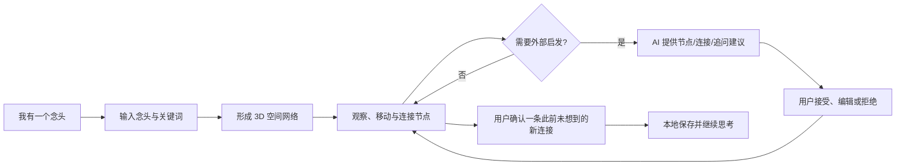

# Grokking恼 产品需求文档（PRD）v1.1｜空间交互迭代版

> 文档状态：v1.1 已更新，与当前产品实现基线对齐
>
> 更新时间：2026-09-02
>
> 产品类型：0→1 创新产品 + AI 能力
>
> 当前阶段：MVP 空间交互增强版已实现，进入用户验证与指标观察
>
> 实现基线：产品 v0.4.0｜GitHub `main` @ `b883636`
>
> 数据结构：`schemaVersion 4`

## 1. 产品概述

### 1.1 产品名称

- 【已确认】项目名：Grokking恼。
- 【创作者原话】“恼”具有双关含义，既指向大脑与思考，也保留灵感受阻、反复琢磨的情绪感。

### 1.2 一句话定位

【AI建议】Grokking恼 是一个以 3D 关键词网络为核心的空间思考工具：用户从“我有一个念头”开始，把脑中的关键词放入空间、建立和发现连接，并在 AI 的陪伴建议下产生此前没有想到的新联系。

### 1.3 产品本质

- 【已确认】产品首先是“强思考工具”，不是 AI 自动替用户完成思考的内容生成器。
- 【已确认】空间网络负责让已有信息重新排列、并置和连接，从而触发涌现。
- 【已确认】AI 是建议者和陪伴思考者，不能未经用户确认直接改写正式思考网络。
- 【已确认】首期核心是 3D 关键词渲染页面；AI 生成完整 3D 世界属于后续能力。

## 2. 背景与问题

### 2.1 用户问题

当用户刚产生一个想法时，通常只掌握少量关键词和有限视角。传统文档要求线性组织，普通思维导图又容易停留在层级拆分，因此用户可能：

- 看不见相距较远概念之间的潜在联系；
- 被自己已有的知识和路径限制；
- 过早进入方案整理，错过发散阶段；
- 使用通用聊天 AI 时，被连续生成的答案牵着走，减少主动思考。

### 2.2 典型场景

【创作者原话】用户在思考一个“生鲜方向”的 Idea，把目前想到的关键词填入画板，形成类似大脑的网络。即使系统没有直接生成新内容，用户也可能因为看到 A、B、C 等节点的空间关系，突然意识到“A 为什么不能直接连接 H”，由此产生新的想法。

## 3. 产品目标与非目标

### 3.1 MVP 核心目标

- 【已确认】用户通过空间网络，产生并确认至少一条自己此前没有想到的新连接。

### 3.2 支撑目标

- 【AI建议】降低记录一个初始念头的门槛，让用户在几秒内进入空间。
- 【AI建议】让关键词之间的距离、聚类和连接具有可理解的语义意义。
- 【AI建议】AI 在不打断思路的前提下，提供缺失视角、潜在连接和追问。
- 【AI建议】让用户离开并重新打开后，可以继续同一段思考。

### 3.3 首期非目标

- 【已确认】不接入 Marble 等实时生成完整 3D 世界的能力。
- 【已确认】不做多人实时协作。
- 【已确认】不优先开发原生 App、小程序、VR 或 AR 版本。
- 【已确认】不让 AI 自动完成完整商业方案或替用户决定最终结论。
- 【已确认】不建设知识库 RAG、社区、模板市场或自治 Agent。

## 4. 目标用户与使用场景

### 4.1 目标用户

- 【已确认】首期不限定垂直行业，以创作者本人真实需求为起点。
- 【AI建议】优先服务“脑中已有一个念头，但尚未形成清晰结构”的个人用户，例如产品经理、创业者、设计师、内容创作者和研究型工作者。

### 4.2 核心使用场景

1. 用户产生一个模糊念头，需要快速捕捉。
2. 用户已想到若干关键词，希望看见它们之间的结构。
3. 用户思考遇到瓶颈，希望获得新的观察角度，而不是直接答案。
4. 用户希望保存当前思考现场，之后继续探索。

## 5. 产品设计原则

1. 【已确认】主动思考优先：产品应增加用户自己的认知活动，而不是增加 AI 输出量。
2. 【已确认】空间优先于对话：主界面是空间网络，聊天或建议面板是辅助入口。
3. 【已确认】建议不等于事实：AI 内容必须经过接受、编辑或拒绝，才能进入正式网络。
4. 【已确认】3D 必须承载信息：深度、距离、聚类和视觉层级用于表达关系，不只是装饰。
5. 【已确认】本地优先：MVP 不依赖账号和云端同步即可完整使用。
6. 【AI建议】渐进披露：默认界面保持安静，复杂能力在需要时出现。

## 6. 核心概念与数据对象

> 以下字段为【AI建议】，将在模块评审和技术设计阶段进一步确认。

### 6.1 Idea（念头空间）

- `id`；
- 【已确认】原始念头采用单一自由文本；
- 【已确认】标题由系统自动生成，并允许用户修改；
- 创建时间、更新时间；
- 当前场景状态；
- 节点和连接集合。

### 6.2 ThoughtNode（思考节点）

- 【已确认】节点文本／关键词支持逐个输入和批量粘贴；
- 来源：用户输入或 AI 建议；
- 三维坐标；
- 可选补充说明；
- 语义类别与视觉状态。

### 6.3 ThoughtEdge（思考连接）

- 起点与终点；
- 来源：用户创建或 AI 建议；
- 用户确认状态；
- 【已确认】可选的一句话连接说明；
- 【已确认】MVP 不设置强制关系类型。

### 6.4 AISuggestion（AI 建议）

- 类型：补充节点、潜在连接、追问；
- 建议内容与简短理由；
- 状态：待处理、已接受、已编辑后接受、已拒绝。

### 6.5 SceneState（语义场景状态）

- 当前语义方向／主题标签；
- 背景、材质、灯光、雾效、粒子等参数；
- 用户手动覆盖状态。

## 7. MVP 核心闭环

## 8. MVP 范围

### 8.1 P0：首个可验证版本

1. 创建一个 Idea，并输入初始念头。
2. 手动新增、编辑、删除关键词节点。
3. 在 3D 空间中浏览、聚焦、移动节点。
4. 手动连接两个节点，并能够确认“这是一个新连接”。
5. AI 提供三类建议：缺失节点、潜在连接、启发式追问。
6. 用户可接受、编辑后接受或拒绝 AI 建议。
7. 系统根据语义方向，从素材库和参数规则中切换背景、材质、灯光、雾效或粒子氛围。
8. Idea、节点、连接与场景状态保存在本地。
9. 用户重新打开后可继续上一次思考。
10. 首页提供本地 Idea 列表，支持打开、重命名、复制和删除。
11. 支持导出和导入 JSON 备份。

### 8.2 P1：验证后增强

- 撤销与重做；
- 搜索、筛选与聚焦节点；
- 思考过程时间线；
- 导出图片；
- AI 介入强度设置；
- 节点详情与长文本笔记。

### 8.3 暂不纳入

- 实时生成可自由漫游的 3D 世界；
- 多端同步和团队协作；
- 自动研究、自动执行任务的 Agent；
- 公共内容社区和模板交易。

## 9. 主流程

### 9.1 进入与创建

1. 用户打开 Web 产品。
2. 首页主入口显示“我有一个念头”。
3. 用户输入一段自由文本，进入新的 3D 思考空间。
4. 系统根据自由文本自动生成可编辑的 Idea 标题。
5. 系统保留手动输入入口，并提供可选的“帮我展开”。

### 9.2 构建网络

1. 用户逐个添加关键词，或一次粘贴多个关键词。
2. 用户可双击画布空白处，在该空间位置直接创建关键词节点。
3. 节点进入空间并自动形成初步布局。
4. 用户可拖动、靠近、分离或连接节点。
5. 新节点确认后，在 AI 自动关系发现开启的情况下，系统判断它与已有关键词是否存在值得提示的联系。
6. 创建连接后，用户可选择补充一句连接说明；MVP 不强制选择关系类型。
7. 系统根据节点语义与结构调整布局和氛围。
8. 桌面端鼠标悬停正式节点时，系统同时显示“连到最近未连接节点”和“通向空白方向”两类就地连线引导。
9. 用户可直接点击预览线身建立连接，也可点击空白方向创建新节点；新节点创建后自动连回起点。
10. 原“连接”工具保留，用于任意远距离节点的明确起点/终点选择；触屏端通过选中节点获得同等入口，不依赖 Hover。

### 9.2.1 3D 空间操作规则

- 【已确认】系统提供 3D 空间与 2D 平面两种视图，两种视图共享同一批节点、连接和选中状态，切换不得丢失数据。
- 【已确认】3D 镜头支持旋转、缩放、平移和受控的键盘游走；2D 视图限制旋转，保持平面导航。
- 【已确认】点击节点进入聚焦状态，镜头平滑推进到节点，焦点节点向前浮起，突出其一层相邻关系，无关节点沿视线后退并弱化。
- 【已确认】正式关系在 3D 视图中使用可点击弧线和方向流光表达空间关系；方向流光只出现在聚焦或选中关系上，避免过量动态干扰。
- 【已确认】用户可通过“全局视图”或 `Esc` 退出聚焦，并自动恢复容纳全部节点的镜头。
- 【已确认】系统通过远近粒子、轻量景深雾、节点发光核心/外壳/环带建立空间层级，但文字标签必须始终保持可读。
- 【已确认】新建 Idea 或新增节点时，系统负责首次空间布局。
- 【已确认】用户手动调整后的节点位置优先保留，系统不得在普通内容更新时强制重排。
- 【已确认】用户主动执行“重新整理”后，系统才重新计算整体布局。

### 9.3 获得 AI 启发

1. AI 首先识别当前 Idea 的思考意图、对象、阶段和已有视角，形成可随网络变化更新的意图画像。
2. 当网络中至少存在 3 个正式关键词节点时，AI 可以显示轻量提示，但不自动弹出完整内容；用户在任意时点均可主动点击“帮我展开”。
3. 用户点击“帮我展开”后，AI 基于意图画像动态选择创意维度，而不是固定输出成本、客户等通用栏目。
4. 每轮最多出现 3 条建议，类型包括新关键词、潜在连接和启发式问题；默认至少覆盖两个不同的思考维度。
5. 用户双击画布并确认新节点后，AI 可自动执行一次增量关系扫描，判断新关键词与已有关键词之间的潜在联系。
6. 每条建议展示简短理由、所属思考维度及关联节点。
7. 新节点和连接以半透明候选态直接出现在空间中，不进入正式网络。
8. 用户接受、修改后接受或拒绝建议；接受后候选内容才转为正式状态。

### 9.4 确认涌现

1. 用户发现一个此前没有想到的连接。
2. 用户创建或接受该连接。
3. 连接旁出现轻量操作“这是新发现”，不弹出强制确认窗口。
4. 用户完成标记后，该连接获得特殊光效或徽标，并可选填一句“为什么这是新发现”。
5. 该行为计入 MVP 核心成功事件，系统显示本次思考已产生的新连接数量。
6. 用户可以继续探索，不因完成成功事件而被迫离开空间。

### 9.4.1 新连接确认验收标准

1. 用户手动建立连接或接受 AI 候选连接后，可以在连接附近找到“这是新发现”操作。
2. 该操作不得以阻塞式弹窗打断用户继续操作。
3. 标记完成后，连接出现区别于普通连接的稳定视觉标识。
4. 用户可以不填写说明直接完成标记，也可以添加和修改“为什么这是新发现”。
5. 当前 Idea 能够统计已标记的新连接数量，并在空间内以轻量方式反馈。
6. 标记状态、可选说明和数量统计随 Idea 本地保存，重新打开后保持一致。
7. 用户标记后仍停留在当前空间，可继续新增节点、连接或请求 AI 建议。

## 10. AI 能力边界

### 10.1 工作模式

- 【已确认】采用混合模式。
- 默认：当网络中至少存在 3 个正式关键词节点时，仅出现轻量、低频、不打断的提示，不自动展开建议。
- 主动入口：用户点击“帮我展开”后，才请求更深层的发散或追问。
- 用户可暂停 AI 建议。

### 10.2 建议类型

1. 缺失节点：指出当前网络可能遗漏的角色、资源、限制、场景或反例。
2. 潜在连接：指出两个已有节点之间可能存在的联系，并说明理由。
3. 启发式追问：通过问题推动用户重新审视假设。

【已确认】每轮最多展示 3 条建议，每条建议都需包含简短理由。

### 10.3 写入规则

- AI 建议的新节点或连接默认以半透明形态出现在空间候选层。
- 未经用户操作，不得成为正式节点或连接。
- 接受前允许编辑。
- 用户拒绝后不应立即重复相同建议。

### 10.4 意图识别与动态创意维度

- 【已确认】AI 在生成建议前识别当前 Idea 的思考对象、用户意图、所处阶段、已有视角和明显空白。
- 意图示例包括但不限于：探索新项目、理解一个主题、解决具体问题、做选择、创作内容、研究趋势。
- 思考阶段包括：发散、建立结构、寻找关系、验证假设和收敛决策；同一 Idea 可随网络变化切换阶段。
- “项目成本”“目标客户”仅是特定项目意图下可能出现的维度，不得成为所有 Idea 的固定输出模板。
- AI 从四类维度动态组合建议：核心事实、系统关系、约束与反例、跨领域迁移与反常连接。
- 每轮 3 条建议默认至少覆盖 2 类不同维度，避免三条建议只是同一视角的改写。
- 意图画像是辅助推断，不替用户给 Idea 强制分类；用户无需先填写行业或模板表单。

### 10.5 新节点增量关系发现

1. 用户双击画布空白处，输入关键词并确认创建正式节点。
2. 当空间内还存在至少 2 个其他正式节点，且“自动发现联系”开启时，系统触发增量关系扫描。
3. AI 比较新节点与已有节点的语义、当前图结构和意图画像，返回最多 3 条值得用户判断的候选连接。
4. 候选连接必须包含起点、终点、关系说明、推荐理由和关系强度；没有足够价值时允许返回 0 条。
5. 候选连接以半透明线或微光提示出现，不打开阻塞式弹窗。
6. 用户可接受、编辑关系说明或拒绝；只有接受后转为正式连接。
7. 用户可以关闭自动关系发现；关闭后仍可选中任意两个节点并主动请求“它们有什么关系？”
8. 【AI建议·成本控制默认值】连续 3 秒内新增的节点合并为一次请求；相同图谱指纹的结果优先复用，避免重复调用。

## 11. 3D 空间与语义场景

### 11.1 首期实现方向

- 【已确认】采用“语义图谱 → 3D 空间布局 → 语义场景渲染”的分层逻辑。
- 【已确认】图数据和思考状态与渲染层解耦，便于后续替换渲染技术或接入生成式世界。
- 【已确认】首期依赖充足的素材库与规则化参数组合，不依赖逐次生成 3D 资产。

### 11.2 场景变化机制

【已确认】系统从整个 Idea 与节点网络中提取当前主要语义方向，映射到一组可控场景参数；不因每个新增关键词立即切换。参数包括：

- 背景色与环境贴图；
- 节点材质、形态与颜色；
- 主光源色温和方向；
- 雾效、粒子密度和运动速度；
- 镜头距离与整体空间尺度。

【已确认】MVP 准备约 6–8 套基础氛围，通过上述参数的组合产生更多视觉变化，不实时生成完整 3D 世界。

【已确认】系统默认自动选择场景并平滑过渡，同时保证文字可读性和操作稳定性。用户可以锁定当前风格，或从系统推荐的其他风格中手动切换。

## 12. 本地存储与隐私

- 【已确认】MVP 仅做本地保存，不建设账号、云端同步和跨设备能力。
- 【已确认】所有变更自动保存，不设置强制保存按钮；界面显示保存中、已保存或保存失败状态。
- 【已确认】首页展示本地 Idea 列表，支持继续打开、重命名、复制和删除；删除前必须二次确认。
- 【已确认】本地至少保存 Idea、节点、连接、AI 建议状态、场景状态和最近打开时间。
- 【已确认】MVP 支持导出和导入 JSON 备份；图片导出放在 P1。
- 【已确认】首次使用 AI 前明确告知将调用云端模型，以及本地保存不等于 AI 请求离线。AI 请求只发送当前 Idea 中完成建议所必需的文本、节点和连接，不读取或发送其他本地 Idea。

### 12.1 保存与管理验收标准

1. 用户新增、编辑、移动或删除节点和连接后，系统自动触发本地保存。
2. 界面在保存过程中显示“保存中”，完成后显示“已保存”，失败时显示可识别的错误状态和重试入口。
3. 关闭并重新打开产品后，Idea 内容、节点位置、连接、候选处理结果和场景状态均可恢复。
4. 首页能够列出所有本地 Idea，并显示标题和最近更新时间。
5. 用户能够打开、重命名和复制任意本地 Idea。
6. 删除 Idea 前必须展示确认提示；取消后数据保持不变。
7. 用户能够将单个 Idea 导出为 JSON，并通过导入恢复为可继续编辑的 Idea。
8. 导入无效或版本不兼容的 JSON 时，系统不得覆盖现有数据，并应说明失败原因。

## 13. 成功判断与指标

### 13.1 北极星行为

- 【已确认】用户通过空间网络产生并确认至少一条此前没有想到的新连接。

### 13.2 验证口径

- 【已确认】核心成功事件：用户创建或接受一条连接，并主动标记为“这是新发现”。
- 【AI建议】首轮可用性测试目标：用户在 10 分钟内建立一个 Idea、输入至少 5 个自己的关键词，并确认至少 1 条新连接。
- 【已确认】“新连接”的真实性依赖用户主动确认，而不是由系统自动替用户判断。

### 13.3 辅助观察指标

- 创建 Idea 后实际添加节点的比例；
- 用户主动建立连接的数量；
- AI 建议的接受、编辑后接受和拒绝比例；
- 单次思考停留时长；
- 保存后再次打开同一 Idea 的比例；
- 用户主观反馈：“它是否让我想到原本没想到的东西？”

## 14. 风险与约束

1. 3D 眩晕或操作负担可能抵消思考价值，需要限制镜头自由度并提供一键回到全局。
2. 节点过多后容易遮挡和失去方向，需要分层、聚类、聚焦和性能降级策略。
3. 场景过度变化会干扰阅读，语义氛围必须服从信息清晰度。
4. AI 建议若过于泛化，会让产品退化为普通脑暴工具，需要结合当前图结构生成建议。
5. 仅本地存储存在清理浏览器数据后丢失的风险，需要明确提示或补充导出能力。
6. 用户是否真的产生“新连接”具有主观性，需要通过行为记录与访谈共同验证。

### 14.1 容量与性能基线

- 【已确认】P0 单个 Idea 的可用容量基线为 60 个正式节点和 100 条正式连接。
- 【已确认】在主流桌面设备上，上述基线规模下的空间交互帧率不低于 30 FPS。
- 【AI建议】超过基线规模后允许启动视觉降级策略，例如降低粒子密度、减少实时特效或弱化非聚焦标签，但不得丢失正式节点和连接数据。

## 15. 模块确认与验收

### 15.1 创建 Idea 与关键词节点

- 【已确认】初始念头采用单一自由文本，标题由系统自动生成且可修改。
- 【已确认】关键词同时支持逐个录入和批量粘贴。
- 【已确认】连接说明为可选的一句话；首期不强制关系类型。

### 15.1.1 模块验收标准

1. 用户只输入一段自由文本即可创建 Idea，不要求预先填写标题或表单字段。
2. Idea 创建后出现系统生成的标题，用户可直接修改并保存。
3. 用户能够连续逐个创建关键词节点。
4. 用户能够一次粘贴多个关键词，并将其拆分为独立节点；具体分隔规则待交互设计确认。
5. 用户可以连接任意两个可见节点。
6. 用户不填写连接说明也能完成连接；填写后可查看和修改该说明。
7. 创建 Idea、节点和连接后，本地刷新或重新打开仍可恢复。

### 15.2 3D 操作

- 【已确认】使用旋转、缩放、平移的受控镜头，不采用游戏式自由行走。
- 【已确认】点击节点后聚焦其一层关系并弱化无关节点，同时提供一键返回全局。
- 【已确认】系统负责首次自动布局；用户移动后的位置优先保留，仅在主动点击“重新整理”时重排。

### 15.2.1 模块验收标准

1. 用户能够通过鼠标或触控板完成旋转、缩放和平移，并且无需使用方向键进行空间行走。
2. 用户点击任意节点后，该节点及其直接相连节点在视觉上明显突出，无关节点相对弱化。
3. 用户可通过固定入口一键返回能够容纳全部节点的全局视图。
4. 新增节点后系统为其分配可见且尽量不遮挡的初始位置。
5. 用户拖动节点并刷新或重新打开 Idea 后，其手动位置保持不变。
6. 普通的节点编辑和连接变化不得触发全图强制重排。
7. 点击“重新整理”后，系统重新计算布局，并允许用户继续手动调整。

### 15.3 AI 建议

- 【已确认】AI 不自动展开建议，只在网络具备可分析信息后显示轻量提示；用户点击“帮我展开”才触发。
- 【已确认】每轮最多展示 3 条建议，类型包括新关键词、潜在连接和启发式问题。
- 【已确认】每条建议展示简短理由；新节点和连接以半透明候选态进入空间。
- 【已确认】候选内容必须经过接受或修改后接受，才能成为正式内容。

### 15.3.1 模块验收标准

1. 用户未点击“帮我展开”时，系统不得自动打开建议列表或将 AI 内容写入空间。
2. 当网络中至少存在 3 个正式关键词节点时，界面可以出现轻量提示，但不得遮挡主要节点或中断当前操作；少于 3 个节点时，用户仍可主动点击“帮我展开”。
3. 用户点击“帮我展开”后，每轮返回的可见建议不超过 3 条。
4. 每条建议明确标识类型，并展示至少一句与当前网络相关的建议理由。
5. AI 建议的新节点和连接与正式内容有清晰的视觉差异，默认采用半透明候选态。
6. 用户能够接受、编辑后接受或拒绝每条建议。
7. 只有接受或编辑后接受的候选内容才写入正式网络，并随 Idea 本地保存。
8. 被拒绝的相同建议不得在紧接着的下一轮中原样重复出现。

### 15.4 语义场景

- 【已确认】场景基于整个 Idea 的主要语义方向判断，不随每个新增关键词立即变化。
- 【已确认】首期准备约 6–8 套基础氛围，以视觉参数组合实现变化，不生成完整 3D 世界。
- 【已确认】系统自动选择并平滑切换；用户可以锁定当前风格或手动选择推荐风格。

### 15.4.1 模块验收标准

1. 创建 Idea 并形成初始关键词网络后，系统能够选择一套与整体语义方向相匹配的基础氛围。
2. 单次新增或编辑普通关键词时，场景不得频繁闪烁或立即跳变。
3. 当 Idea 的主要语义方向发生明显变化时，系统能够重新推荐或切换氛围。
4. 场景切换采用平滑过渡，过程中节点文字保持可读，现有空间操作不中断。
5. MVP 至少提供 6 套、至多以 8 套为目标的可用基础氛围。
6. 用户锁定场景后，系统不得因语义变化自动替换该场景。
7. 用户能够查看系统推荐的其他风格并手动切换，切换结果随 Idea 本地保存。

## 16. 信息架构与页面结构

### 16.1 首页／Idea 管理

首页承担两个任务：快速开始一个念头，以及返回已有思考现场。

- 主入口：“我有一个念头”自由文本输入框；
- 次入口：导入 JSON；
- 最近 Idea：标题、最近更新时间、新发现数量；
- Idea 操作：打开、重命名、复制、导出 JSON、删除；
- 删除为高风险操作，必须二次确认；
- 空状态只保留一句引导和主输入框，避免模板与功能说明抢占注意力。

### 16.2 Idea 3D 思考空间

- 顶部：返回首页、Idea 标题、保存状态、3D / 2D 视图切换；
- 面板入口：与 3D / 2D 切换并列，点击或桌面端悬停后向下展开“工具 / 何 / 论”，不再单独悬浮于画布右侧；
- 中央：3D 节点与连接画布；
- 主操作：“添加关键词”“连接节点”“帮我展开”；
- 视图操作：返回全局、重新整理、缩放、场景切换；
- 状态反馈：候选建议、本次新发现数量、AI 请求状态；
- 辅助面板：当前节点／连接详情，仅在选中内容后出现；
- 所有面板都不得永久压缩主画布，关闭后恢复沉浸式空间。

### 16.3 首次使用引导

【AI建议·默认方案】采用不超过 3 步的可跳过引导：

1. 输入或粘贴关键词；
2. 连接两个节点，或点击节点观察关系；
3. 在需要时点击“帮我展开”。

## 17. 功能需求清单

| 编号 | 模块 | 优先级 | 需求 |
|---|---|---:|---|
| FR-HOME-001 | Idea 创建 | P0 | 用户输入一段自由文本即可创建 Idea |
| FR-HOME-002 | Idea 标题 | P0 | 系统自动生成标题，用户可修改 |
| FR-HOME-003 | Idea 管理 | P0 | 支持打开、重命名、复制和删除 |
| FR-HOME-004 | 数据备份 | P0 | 支持单个 Idea 导出和导入 JSON |
| FR-NODE-001 | 节点创建 | P0 | 支持逐个输入关键词 |
| FR-NODE-002 | 批量创建 | P0 | 支持批量粘贴、拆分预览和确认生成 |
| FR-NODE-003 | 节点编辑 | P0 | 支持编辑和删除正式节点 |
| FR-NODE-004 | 节点位置 | P0 | 支持拖动节点，手动位置持久化 |
| FR-NODE-005 | 画布快捷创建 | P0 | 双击画布空白处，在对应空间位置创建关键词节点 |
| FR-EDGE-001 | 创建连接 | P0 | 支持连接任意两个正式节点 |
| FR-EDGE-002 | 连接说明 | P0 | 支持选填、修改一句连接说明 |
| FR-EDGE-003 | 新发现 | P0 | 支持将连接标记为“这是新发现” |
| FR-EDGE-004 | 就地快捷连接 | P0 | 悬停或选中节点后显示可点击预览线，直接连到最近未连接节点 |
| FR-EDGE-005 | 空白方向分支 | P0 | 支持从当前节点向空白方向创建新节点，并自动连回起点 |
| FR-VIEW-001 | 3D 镜头 | P0 | 支持受控旋转、缩放和平移 |
| FR-VIEW-002 | 节点聚焦 | P0 | 聚焦节点及其一层关系，弱化无关节点 |
| FR-VIEW-003 | 全局视图 | P0 | 支持一键返回容纳全部节点的视图 |
| FR-VIEW-004 | 自动布局 | P0 | 首次自动布局；仅用户主动操作时全图重排 |
| FR-VIEW-005 | 2D / 3D 切换 | P0 | 同一 Idea 支持 2D 平面与 3D 空间切换，不丢失节点、连接和位置数据 |
| FR-VIEW-006 | 空间聚焦反馈 | P0 | 聚焦时镜头推进、焦点前浮、无关网络后退，并支持减少动态设置 |
| FR-UI-001 | 统一顶部面板入口 | P0 | 面板入口紧邻 3D / 2D 切换，统一进入工具、何、论三类辅助面板 |
| FR-AI-001 | AI 提示 | P0 | 至少 3 个正式节点后可显示轻量提示 |
| FR-AI-002 | 主动展开 | P0 | 用户可随时点击“帮我展开” |
| FR-AI-003 | 建议类型 | P0 | 提供新关键词、潜在连接、启发式问题 |
| FR-AI-004 | 候选态 | P0 | AI 节点和连接先进入半透明候选层 |
| FR-AI-005 | 建议处理 | P0 | 支持接受、编辑后接受和拒绝 |
| FR-AI-006 | 意图识别 | P0 | 根据 Idea 内容与图结构识别思考意图和阶段 |
| FR-AI-007 | 动态维度 | P0 | 每轮建议动态选取维度，默认至少覆盖两个维度类别 |
| FR-AI-008 | 增量关系扫描 | P0 | 新节点创建后分析其与已有节点的潜在联系 |
| FR-AI-009 | 关系发现开关 | P0 | 支持关闭自动扫描，并保留手动关系分析入口 |
| FR-SCENE-001 | 自动场景 | P0 | 根据 Idea 主要语义选择基础氛围 |
| FR-SCENE-002 | 场景控制 | P0 | 支持锁定和手动切换推荐风格 |
| FR-SAVE-001 | 自动保存 | P0 | 内容与空间变化自动保存 |
| FR-SAVE-002 | 状态反馈 | P0 | 显示保存中、已保存、保存失败 |
| FR-P1-001 | 历史能力 | P1 | 撤销、重做和思考时间线 |
| FR-P1-002 | 查找能力 | P1 | 搜索、筛选和更深层聚焦 |
| FR-P1-003 | 输出能力 | P1 | 导出空间图片 |
| FR-P1-004 | 内容能力 | P1 | 节点长文本笔记 |

## 18. 核心状态模型

### 18.1 节点状态

- formal：用户正式网络中的节点；
- candidate：AI 建议但尚未接受的半透明节点；
- editing：正在修改候选或正式节点；
- deleted：已从当前 Idea 移除，不参与布局和 AI 上下文。

状态流为 candidate → formal 或 candidate → rejected。正式节点不由 AI 自动降级或删除。

### 18.2 连接状态

- formal：普通正式连接；
- candidate：AI 推荐的潜在连接；
- discovery：用户明确标记的“新发现”连接。

discovery 是正式连接上的用户确认属性，不是 AI 对内容价值的判断。

### 18.3 AI 请求状态

状态流为 idle → loading → success／partial／error／cancelled。

AI 请求同时记录模式：intent_profile（意图画像）、relation_probe（新增节点关系扫描）或 deep_expand（用户主动展开）。不同模式共享请求状态，但结果不得串写到其他 Idea 或其他图谱版本。

- loading：显示非阻塞加载状态，用户仍可操作空间；
- partial：允许展示已成功解析的建议，并说明结果不完整；
- error：保留手动思考能力，提供重试，不向网络写入残缺内容；
- cancelled：用户离开 Idea 或主动取消后停止展示本轮结果。

### 18.4 保存状态

状态流为 clean → saving → saved／failed。

保存失败不得静默；失败期间继续保留内存中的最新编辑，并提供重试与 JSON 紧急导出入口。

## 19. 数据模型

### 19.1 Idea

| 字段 | 说明 |
|---|---|
| id / schemaVersion | 唯一标识与数据结构版本 |
| title / seedText | 标题与原始念头 |
| createdAt / updatedAt / lastOpenedAt | 时间信息 |
| nodes / edges / suggestions | 节点、连接与 AI 建议集合 |
| sceneState | 当前语义场景状态 |
| discoveryCount | 已确认的新发现数量 |
| intentProfile | AI 推断的思考意图、阶段、已有维度和缺失维度 |
| autoRelationDiscovery | 是否开启新增节点后的自动关系发现 |

### 19.2 ThoughtNode

| 字段 | 说明 |
|---|---|
| id / text | 标识与关键词文本 |
| source | user 或 ai |
| status | formal 或 candidate |
| position | 三维坐标 x、y、z |
| isPositionPinned | 是否优先保留用户位置 |
| semanticTags | 语义标签 |
| createdAt / updatedAt | 时间信息 |

### 19.3 ThoughtEdge

| 字段 | 说明 |
|---|---|
| id | 唯一标识 |
| sourceNodeId / targetNodeId | 起点与终点 |
| source / status | 来源与正式／候选状态 |
| note | 可选连接说明 |
| isDiscovery / discoveryNote | 新发现标记与可选说明 |
| createdAt / updatedAt | 时间信息 |

### 19.4 AISuggestion

| 字段 | 说明 |
|---|---|
| id / requestId | 建议与请求标识 |
| type | node、edge 或 question |
| content / reason | 建议内容与理由 |
| dimension | 本条建议所属的动态思考维度 |
| relatedNodeIds | 关联节点 |
| status | pending、accepted、edited_accepted 或 rejected |
| createdAt | 创建时间 |

### 19.5 SceneState

| 字段 | 说明 |
|---|---|
| semanticDirection | 当前主要语义方向 |
| atmosphereId | 基础氛围标识 |
| isLocked | 是否锁定 |
| manualOverride | 用户手动覆盖状态 |
| lastChangedAt | 最近变化时间 |

## 20. AI 产品契约

AI 能力分为三个相互独立但共享当前图谱上下文的调用模式：

1. intent_profile：识别 Idea 的思考意图、阶段和维度空白；
2. relation_probe：围绕一个或一组新增节点寻找与已有节点的潜在联系；
3. deep_expand：用户点击“帮我展开”后进行更广的创意发散。

### 20.1 输入边界

每次请求仅发送当前 Idea 中完成建议所需的：

- 原始念头与标题；
- 正式节点文本；
- 正式连接及可选说明；
- 已拒绝建议的摘要或标识，用于避免原样重复；
- 当前聚焦节点（如有）。

不得发送其他 Idea、本地文件、浏览历史或无关设备信息。

### 20.2 输出约束

- 每轮最多 3 条建议；
- 每条必须标明类型、内容、理由和关联节点；
- 新连接必须引用当前存在的节点，或同时提供对应候选节点；
- 问题类建议只作为思考提示，不自动转为正式节点；
- 无法形成可靠建议时允许返回更少结果，不用低质量内容补足；
- 输出解析失败时整轮不写入正式网络。
- 建议输出包含 dimension 字段；deep_expand 的多条结果不得全部集中在同一固定维度。
- relation_probe 输出还必须包含 sourceNodeId、targetNodeId、relation、reason 和 strength。
- relation_probe 没有发现有价值联系时返回空数组，不得为了凑数制造牵强连接。

### 20.3 建议策略

【AI建议·第一版默认策略】

1. 优先寻找当前网络缺少的视角，而不是同义改写；
2. 潜在连接优先跨越距离较远或聚类不同的节点；
3. 追问优先挑战隐含假设、约束、利益相关者和反例；
4. 避免直接输出完整解决方案；
5. 建议理由保持简短，让用户回到空间继续思考。
6. 先判断用户在“想什么”和“思考到哪一步”，再决定建议维度。
7. 新节点关系扫描不仅检查空间上相邻的节点，也要寻找跨聚类、跨主题的弱联系。

### 20.4 降级策略

- AI 超时、限流或不可用时，空间编辑、本地保存和手动连接保持可用；
- 系统展示可理解的失败原因与重试入口；
- 连续失败时暂停自动轻提示，只保留主动入口；
- 模型或供应商选择属于技术方案，不与图数据结构绑定。

## 21. 语义场景规则

### 21.1 第一批基础氛围

【AI建议·第一版默认方案】首批采用 6 套基础氛围：

1. 生长／自然；
2. 理性／秩序；
3. 科技／未来；
4. 人文／温度；
5. 探索／未知；
6. 冲突／挑战。

另外 2 套作为素材与测试余量，不作为首发阻断项。

### 21.2 场景重新判断

【AI建议·第一版默认规则】

- 创建 Idea 并形成至少 3 个正式节点后进行首次判断；
- 一次新增、删除或修改累计影响 3 个以上正式节点时，可以重新判断；
- 两次自动切换至少间隔 30 秒；
- 用户锁定后停止自动切换，直到主动解锁；
- 场景参数不得改变节点和连接的真实数据。

## 22. 非功能要求

### 22.1 性能

- 单 Idea 60 个正式节点、100 条正式连接为 P0 可用容量基线；
- 上述规模下，主流桌面设备交互帧率不低于 30 FPS；
- 首次进入空间应先呈现可操作骨架，再异步加载非关键氛围特效；
- 页面不可见时暂停非必要动画；
- 超过容量基线后优先降低粒子、光效和非聚焦标签，不丢失数据。

### 22.2 可用性与无障碍

- 所有按钮具有可见文字或无障碍名称；
- 键盘可访问首页、节点列表、AI 建议和主要操作；
- 拖动不是唯一操作路径，提供节点位置重置或“移至聚焦区”操作；
- 焦点状态清晰，正文与背景对比度不低于 4.5:1；
- 支持“减少动态效果”，关闭非必要粒子和大幅场景动画；
- 提供返回全局能力，避免用户在 3D 空间迷失。

### 22.3 兼容性

【AI建议·第一版范围】桌面 Web 优先，覆盖当前主流 Chrome、Edge 和 Safari。移动端第一版保证能够打开和浏览 Idea，但复杂编辑体验不作为 P0 验收门槛。

### 22.4 数据与隐私

- Idea 默认只保存在本地；
- 首次调用云端 AI 前必须明确告知数据发送范围；
- 删除 Idea 前二次确认；
- JSON 导入不得覆盖现有 Idea，默认创建副本；
- 导入失败不得影响现有本地数据；
- 不在前端明文保存模型密钥。

## 23. 异常与边界处理

| 场景 | 处理规则 |
|---|---|
| 初始念头为空 | 禁止创建，并在输入处提示先写下一点正在想的东西 |
| 批量粘贴无法拆分 | 保留原文预览，让用户手动调整后再生成 |
| 创建重复关键词 | 允许创建，但提示已有同名节点，并可聚焦已有节点 |
| 连接节点自身 | 禁止创建自连接 |
| 重复连接 | 聚焦已有连接，不重复创建 |
| 删除有关联的节点 | 提示将同时删除的连接数量，确认后执行 |
| AI 返回空结果 | 说明本轮没有形成有价值的建议，允许调整后重试 |
| AI 返回不可解析结果 | 不生成候选内容，记录错误并提供重试 |
| AI 请求中离开页面 | 取消展示本轮结果，不污染其他 Idea |
| 意图识别不确定 | 保留多个候选意图及置信度，不强制给 Idea 贴单一标签 |
| 新节点没有可靠联系 | 不显示候选连线，允许用户继续输入或主动选择节点分析 |
| 连续快速添加节点 | 合并为一次关系扫描，不为每个按键或未确认节点发起调用 |
| 本地保存失败 | 显示失败、重试与 JSON 紧急导出 |
| JSON 版本较旧 | 尝试迁移；失败时说明版本且不覆盖现有数据 |
| JSON 损坏 | 拒绝导入并指出文件不可识别 |
| 节点超过 60 个 | 提示超过首期推荐规模并启动视觉性能降级 |
| WebGL／3D 不可用 | 提供简化 2D 列表与连接浏览，不阻止数据导出 |

## 24. 数据埋点与验证方案

### 24.1 核心事件

| 事件 | 触发条件 |
|---|---|
| idea_created | 成功创建 Idea |
| node_created | 正式节点创建成功 |
| edge_created | 正式连接创建成功 |
| ai_expand_requested | 用户点击“帮我展开” |
| intent_profile_updated | Idea 的意图画像完成首次识别或发生更新 |
| relation_probe_requested | 新节点触发增量关系扫描 |
| relation_candidate_shown | 候选连接在空间中显示 |
| ai_suggestion_resolved | 建议被接受、编辑后接受或拒绝 |
| discovery_marked | 用户标记“这是新发现” |
| idea_reopened | 用户再次打开已有 Idea |
| json_exported | 用户成功导出备份 |

### 24.2 核心指标

- 首次 Idea 中产生 discovery_marked 的用户比例；
- 从 idea_created 到第一次 discovery_marked 的时长；
- 新发现来自手动连接与 AI 候选连接的比例；
- AI 建议接受、编辑后接受和拒绝比例；
- 新节点触发候选连接的比例及候选连接接受率；
- 不同创意维度在建议中的覆盖分布，监控是否重新固化为少数模板；
- 创建后 7 日内再次打开同一 Idea 的比例。

### 24.3 MVP 验证任务

【AI建议·第一轮测试口径】邀请目标用户用真实念头完成一次不超过 20 分钟的自由思考。观察其能否：

1. 创建 Idea；
2. 添加至少 5 个自己的关键词；
3. 建立或接受连接；
4. 标记至少一条“这是新发现”；
5. 解释该连接为何此前没有想到。

## 25. 发布验收矩阵

| 验收领域 | P0 通过条件 |
|---|---|
| 核心闭环 | 可以从创建念头走到标记新发现，并继续探索 |
| 用户控制 | AI 内容未经接受不得进入正式网络 |
| 意图识别 | 不要求用户选择固定模板，AI 能根据同一 Idea 的变化更新意图与思考阶段 |
| 创意多样性 | “帮我展开”的建议默认覆盖至少两个维度，且不会固定重复成本／客户模板 |
| 增量关系发现 | 双击新增节点后可出现最多 3 条带理由的候选连接，接受后才进入正式网络 |
| 空间操作 | 2D / 3D 可切换；镜头、推进聚焦、全局返回、拖动、弧线连接和重新整理可用 |
| 快捷连接 | 悬停/选中节点后同时出现已有节点方向和空白方向；点击线身可连接，新节点可自动回连 |
| 面板导航 | 面板入口与 2D / 3D 切换同组；桌面端悬停和移动端点击均可展开，触控目标不小于 48px |
| 场景系统 | 至少 6 套氛围可用，自动切换、锁定和手动切换有效 |
| 本地数据 | 刷新和重新打开后，内容、位置和场景可恢复 |
| 数据备份 | JSON 可导出并重新导入为独立 Idea |
| AI 降级 | AI 不可用时手动思考与保存仍完整可用 |
| 性能 | 基线规模下主流桌面设备不低于 30 FPS |
| 隐私 | 首次云端调用前完成明确告知 |
| 数据安全 | 删除、导入和保存失败不会静默造成不可恢复的覆盖 |

## 26. 依赖、风险与后续决策

### 26.1 外部依赖

- 云端大语言模型及安全的服务端调用代理；
- 3D 图渲染、空间布局与文字标签能力；
- 本地结构化存储；
- 6–8 套经过可读性验证的场景素材和参数预设。

### 26.2 主要风险

- 3D 新鲜感可能高于实际思考价值，必须用“新发现”行为验证；
- AI 建议可能泛化或过度主导，需要持续检查建议质量；
- 节点增加后遮挡、标签可读性和性能可能下降；
- 本地存储可能因浏览器清理而丢失，必须突出 JSON 备份；
- 场景变化可能干扰思考，用户锁定权和减少动态效果不可省略。

### 26.3 不阻塞第一版的技术决策

以下内容交由原型与技术设计阶段在既定产品边界内确定，不再逐项请求产品确认：

- 具体 3D 渲染库与布局算法；
- 本地数据库实现；
- 大模型供应商与具体型号；
- 场景素材格式和加载策略；
- 内测埋点采用本地日志还是匿名服务。

如后续方案涉及把全部本地 Idea 上传云端、不可恢复的数据迁移、付费调用失控或改变“AI 不自动写入正式网络”的原则，则属于关键红线，必须重新确认。

## 27. 版本记录

### 27.1 版本分类规则

| 版本类型 | 格式 | 用途 | 当前版本 |
|---|---|---|---|
| PRD 文档版本 | `v主版本.次版本` | 记录产品范围、交互规则和验收口径；需求语义或验收标准变化时升级 | `v1.1` |
| 产品实现版本 | `v主版本.次版本.修订版` | 记录可运行产品里程碑；功能增强升次版本，缺陷修复升修订版 | `v0.4.0` |
| 数据结构版本 | `schemaVersion N` | 用于 IndexedDB / JSON 兼容与迁移；只有数据结构不兼容变化时升级 | `schemaVersion 4` |
| 技术文档版本 | 各文档独立维护 | 记录架构、接口、部署或阶段实现，不与 PRD 版本强行同步 | 见各文档页首 |

版本更新原则：

1. 每次产品版本合并到 GitHub `main` 后，必须在本节增加产品实现版本记录，并同步更新相关功能需求和验收矩阵。
2. PRD 升级不等于数据结构升级；数据结构版本必须以代码中 `SCHEMA_VERSION` 为准。
3. 开发记录负责说明“如何实现”，PRD 负责说明“用户获得什么、如何验收”，两者不重复堆叠技术细节。

### 27.2 PRD 文档版本

| 版本 | 日期 | 状态 | 内容 |
|---|---|---|---|
| v0.1 | 2026-08-25 | 过程版本 | 完成定位、范围、主流程与核心成功方向 |
| v0.2 | 2026-08-25 | 定稿候选过程版 | 完成模块确认与模拟评审 |
| v1.0 | 2026-08-25 | 第一版草案 | 补齐信息架构、功能清单、状态模型、数据模型、AI 契约、异常处理、非功能要求和发布验收矩阵 |
| v1.0-R1 | 2026-08-25 | 第一版修订 | 增加意图识别、动态创意维度、双击新增节点和增量关系发现机制 |
| v1.1 | 2026-09-02 | 空间交互迭代版 | 补齐 2D / 3D 切换、推进式聚焦、空间层级、可点击弧线、悬停快捷连接、空白方向分支和统一顶部面板入口需求，建立版本分类规则 |

### 27.3 产品实现里程碑

| 版本 | 日期 | 状态 | 对应内容 |
|---|---|---|---|
| v0.2.0 | 2026-08-28 | 已完成 | 商业透视思维空间核心闭环 |
| v0.2.1 | 2026-08-29 | 已完成 | 首页多关键词拆分与批量节点创建 |
| v0.3.0 | 2026-08-31 | 已完成 | 自适应 2D / 3D 画布、镜头控制与标签 LOD |
| v0.3.1 | 2026-08-31 | 已完成 | 统一面板入口原型、悬停就地连线与空白方向自动回连 |
| v0.4.0 | 2026-09-01 | 已合并 | 空间景深、节点立体化、可点击弧线、方向流光、推进式聚焦，以及面板入口迁移到 3D / 2D 切换器旁；GitHub `main` @ `b883636` |

## 28. 文档状态

- 本文档已更新至 PRD v1.1，并与产品 v0.4.0 实现基线对齐。
- 当前空间交互、快捷连线和顶部面板布局已进入可验证状态；AI 质量、新发现指标和场景多样性仍需持续验证。
- 后续默认由 AI 自主补充和修订非红线细节，不再逐项请求确认。
- 仅当涉及隐私范围扩大、不可逆数据风险、外部付费失控或产品核心原则变化时，再请求创作者确认。
