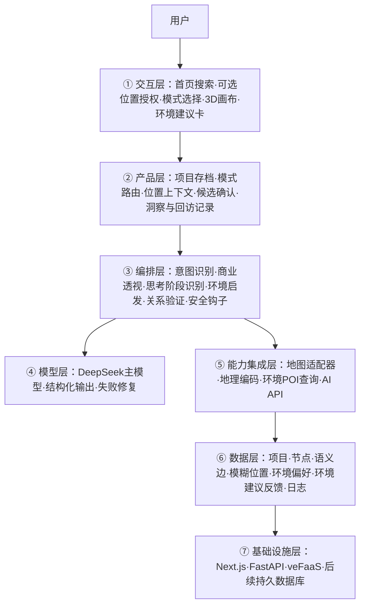

# Grokking恼｜商业透视思维空间开发方案 v0.1

> 状态：Step 1–4 已完成，待审核；审核后进入 Step 5 开发。
> 开发分支：`feature/商业透视思维空间`
> 视觉基线：`version/浅色调当前版本`

## 一句话定位

Grokking恼 是一个连接“知识发散”与“现实环境激发”的商业思维空间：用户输入一个商业关键词，系统从横向相邻业态和纵向产业链展开；当用户需要跳出既有思路时，再结合位置、时间和思考阶段，建议一个现实环境行动，帮助灵感与顿悟发生。

核心判断：大模型可以减少用户在产生灵感前搜集知识、补齐信息与建立初始关联的成本，但不能替代灵感发生时所需的身体状态、环境刺激、节奏变化和偶然观察。地图的价值是把思考从屏幕延伸到现实世界，而不是给商业结论增加一个地图装饰。

## Step 1｜需求拆解

| 维度 | 当前结论 | 状态 |
|---|---|---|
| 目标 | 将模糊商业念头转换为可探索的横向业态网络、纵向产业链和少量商业洞察 | 明确 |
| 用户 | 暂定为正在观察本地生意、选品、开店或寻找商业机会的个体；具体首批用户画像仍需内测验证 | 待验证 |
| 核心闭环 | 输入关键词与模式 → AI补齐知识并横向/纵向展开 → 用户确认连接 → AI识别思考阶段 → 在合适时机建议现实环境行动 → 用户回来记录新想法 → 获得1–2条洞察并存档 | 明确 |
| 交付物 | 可继续编辑的商业关系空间 + 横向业态组 + 纵向产业链 + 1–2条商业洞察 + 可选的现实环境启发建议 | 明确 |
| 边界 | 不替用户作投资结论；不伪造真实门店、价格、客流与市场数据；敏感内容继续服务端拦截 | 明确 |
| 地图数据源 | 建议国内优先采用高德地图 Web SDK/开放平台，浏览器定位作为位置来源；正式供应商与 Key 尚未确认 | 待确认 |
| 成本约束 | 地图 API、POI 搜索和 AI 调用需要分别计量；MVP 先控制为主动触发，不后台持续请求 | 明确 |

### MVP 成功标准

一次有效会话中，用户至少：

1. 接受一条此前没有想到的横向或纵向连接；
2. 主动打开或保存一条商业洞察；
3. 能在 10 分钟内形成一张可继续思考的商业关系图。

首轮建议观测：新空间创建完成率、AI候选接受率、首次洞察产生时间、环境建议采纳率、外出后新增节点率、次日返回率、地图授权率与拒绝率。

## Step 2｜Harness 五要素

| 要素 | 设计 |
|---|---|
| 工具 | 浏览器定位、位置搜索、附近环境检索、商业横向展开、产业链纵向展开、思考阶段识别、环境启发推荐、关系验证、洞察总结、项目存档 |
| 知识 | 业态分类体系、产业链角色体系、商业关系类型、创造力与环境启发规则、内容安全规则、用户已确认/拒绝的连接 |
| 观察 | 定位授权结果、附近环境候选、用户当前思考阶段、连续操作时长、候选接受/拒绝、关系图变化、用户外出后新增节点、错误与耗时 |
| 行动 | 在首页选择位置与模式；在画布产生分层候选节点/连线；适时给出一条现实环境建议；用户回来补充新想法；生成并保存洞察 |
| 权限 | 定位必须明确授权；精确坐标最小化存储；第三方地图调用需披露；AI建议不等于事实；敏感输入继续默认拒绝 |

## Step 3｜组件选型

| 组件 | 选择 | 原因 |
|---|---|---|
| Agent Loop / 工具系统 | 保留 | AI需要根据当前图谱、位置和模式决定建议 |
| 权限与安全钩子 | 保留并强化 | 定位授权、第三方地图、内容安全和提示词注入 |
| 记忆系统 | 轻量实现 | 记住用户偏好的行业、城市尺度、已拒绝方向；不保存无关隐私 |
| 工作流运行时 | 暂不引入 | 当前“横向 + 纵向 + 洞察”可通过单次结构化响应完成，无需复杂编排 |
| 子Agent/团队/定时任务 | 不引入 | MVP是同步单人思考，不需要并行自治 |
| 地图与环境启发适配层 | 新增 | 隔离地图供应商，并把POI结果转换为可解释、可选的环境行动，而不是商业事实 |

## Step 4｜产品与系统方案

### 4.1 首页信息架构

首页保持浅色氛围，调整为三层：

1. **顶部位置带**：显示“让环境参与思考 / 使用当前位置 / 暂不使用位置”。首次不自动弹权限，用户点击后才请求浏览器定位。
2. **核心输入区**：一个搜索型输入框，示例“我想看看成都川菜还能连接哪些生意”。
3. **思考模式**：输入框内或下方二选一：
   - `商业深思`：输出横向业态、纵向链路与商业洞察；
   - `日常发散`：保持原有自由联想，不强制商业框架。
4. **项目存档**：保留已有项目卡片、复制和删除；卡片新增模式、位置、最近洞察和“外出后新想法”记录。

建议首页首屏以输入为主、存档为次。地图只承担位置确认与环境建议，不在首页铺成大地图，不让它抢占创作入口。

### 4.2 地图与位置模块

位置有三级精度：

- 城市：用于给出不依赖精确位置的环境类型建议；
- 区域/商圈：用于寻找公园、江边、街区、咖啡馆、书店、市场、博物馆等启发环境；
- 当前位置：用于给出可步行到达的现实行动建议。

权限流程：

`点击使用当前位置 → 解释用途 → 浏览器授权 → 反向地理编码 → 用户确认位置标签 → 写入项目`

拒绝或失败时：允许手动搜索城市/商圈；地图和定位失败不得阻止进入思考空间。

MVP只保存用户确认后的地点标签、城市/行政区和模糊中心点；不保存持续轨迹，不后台定位，不记录用户实际行走路线。

#### 环境启发引擎

地图模块接收的不是“帮我找一家店”，而是“我现在处于什么思考状态，什么环境变化可能帮助我”。

建议输入：

- 当前主题与已形成的节点；
- 思考模式（商业深思/日常发散）；
- 当前阶段（刚开始、信息过载、连接停滞、需要收敛）；
- 用户可接受的时间范围（例如15/30/60分钟）；
- 模糊位置、当前时间与天气（天气数据二期接入）；
- 用户主动设置的偏好，例如安静/热闹、室内/室外、是否愿意步行。

建议输出最多1条主建议和1条备选：

```json
{
  "primary": {
    "place_type": "河边步道",
    "place_name": "附近可步行到达的滨水步道",
    "duration_minutes": 25,
    "activity": "不继续搜索资料，边走边听一首熟悉的音乐，只观察沿路有哪些生意在争夺同一种注意力。",
    "why_now": "你已经积累了较多餐饮节点，但连接集中在供应链，暂时缺少消费场景视角。",
    "return_prompt": "回来后记录三个沿路观察到的消费动作。"
  },
  "alternative": null
}
```

触发原则：

- 默认由用户主动点击“换个环境想一想”，不强制打断；
- 当连续思考时间较长、反复拒绝候选或网络长期无新连接时，只做一次温和提示；
- 推荐环境必须说明“为什么此刻适合”，不能只给地点排行榜；
- 音乐只建议活动与节奏，MVP不直接读取用户音乐账号或自动播放；
- 推荐是创造力干预，不声称一定能带来灵感或改善心理状态。

### 4.3 AI输出契约

商业深思不再返回混杂的三条建议，而返回稳定的商业透视结构：

```json
{
  "intent": {
    "subject": "四川菜",
    "location_scope": "成都·高新区",
    "assumptions": []
  },
  "horizontal_clusters": [
    {
      "category": "相邻餐饮业态",
      "items": ["本帮菜", "甜品", "咖啡", "特色小吃", "夜宵"]
    }
  ],
  "vertical_chain": [
    {"stage": "上游", "items": ["选种育种", "种植养殖", "采购"]},
    {"stage": "中游", "items": ["冷链物流", "中央厨房", "门店运营"]},
    {"stage": "下游", "items": ["外卖平台", "团购", "会员复购"]}
  ],
  "insights": [
    "川菜的竞争不只发生在菜品，也发生在夜宵时段和外卖履约效率。"
  ],
  "thinking_stage": "connection_stalled",
  "environment_cue": {
    "needed": true,
    "reason": "当前连接集中在供应链，需要切换到真实消费场景观察"
  }
}
```

数量规则：

- 横向：5个主要方向，允许按类别成组；
- 纵向：5–10个环节，必须标明上下游阶段和关系；
- 洞察：1–2条，每条说明“连接是什么、为什么值得看”，禁止堆砌建议；
- 事实边界：没有真实数据源时只能表达为假设、机会或待验证问题，不能声称当地真实客流、销量或竞争结论。

### 4.4 画布布局与连线语义

画布从自由力导向升级为“语义约束 + 可拖动微调”：

- 中心：用户原始关键词；
- 横向层：围绕中心形成扇形/环形业态簇；
- 纵向层：按上游 → 中游 → 下游形成有方向的链路；
- 环境层：不把具体地点混入商业关键词网络，以一张可关闭的“去现实里想一想”卡片出现；
- 洞察层：不生成大量节点，以 1–2 张浮动洞察卡关联对应节点。

连线类型至少区分：

| 关系 | 含义 | 视觉 |
|---|---|---|
| 相邻业态 | 共同客群、场景或消费替代 | 柔和实线 |
| 产业链 | 上下游供给、加工、履约、销售 | 带方向箭头 |
| 用户确认的新连接 | 用户认可的涌现关系 | 高亮强调线 |
| AI候选 | 尚未确认 | 半透明候选线 |

布局交互：聚焦节点时以该节点为局部中心，但不破坏横向/纵向总体方向；用户拖动后锁定人工位置；重新整理只整理未锁定节点。

### 4.5 分层架构



数据流：用户选择模式并输入关键词 → 产品层创建项目 → 编排层把关键词、已有图谱和拒绝历史组合为可信数据 → 模型生成结构化横向/纵向透视 → 服务端校验数量、引用、安全与事实边界 → 前端以候选态渲染 → 用户接受后写入正式图谱；需要转换环境时，用户授权模糊位置 → 地图层返回附近环境类型 → AI结合当前思考阶段生成一条行动建议 → 用户回来记录新节点 → 系统生成并保存1–2条洞察。

### 4.6 工具清单

| 工具 | 输入 | 输出 | 副作用 | 权限 |
|---|---|---|---|---|
| `request_location` | 用户点击 | 浏览器坐标/拒绝/失败 | 读取位置 | 明确授权 |
| `search_place` | 城市/商圈文本 | 地点候选 | 第三方请求 | 用户主动输入 |
| `query_inspiration_places` | 模糊中心点、环境偏好、时间范围 | 公园/步道/街区/书店/咖啡馆等环境候选 | 第三方请求与额度 | 用户主动触发 |
| `generate_business_lens` | 关键词、位置、图谱、拒绝历史 | 横向/纵向/洞察结构 | AI额度 | 自动，受安全检查 |
| `recommend_environment_shift` | 思考阶段、环境候选、时间与偏好 | 1条主建议+1条备选+返回后记录问题 | AI额度 | 用户主动或温和提示后确认 |
| `validate_relations` | 候选关系与已有节点 | 合法候选 | 无 | 自动 |
| `save_project_context` | 用户确认的位置与模式 | 存档确认 | 写本地/后续数据库 | 用户可删除 |

### 4.7 安全、降级与可观测性

- 定位：不点击不请求；拒绝后不重复骚扰；无定位可完整使用产品。
- 地图：SDK/配额失败时降级为通用环境类型建议，明确“未使用实时附近地点”；不得编造具体场所。
- AI：结构不合法自动修复一次；仍失败返回手动发散入口，不写入错误节点。
- 注入与敏感内容：继续在模型调用前和输出后双重检查。
- 商业风险：所有洞察标记为思考线索，不构成投资、经营或收益承诺。
- 日志：记录模式、位置精度等级、AI耗时、候选数量、接受/拒绝，不记录无关精确位置与输入框原文到普通日志。

## 开发切片（审核后执行）

1. **切片 A：首页入口与项目模型**：位置条、搜索框、双模式、存档字段迁移。
2. **切片 B：商业透视 AI 合约**：后端 schema、提示词、mock、校验和测试。
3. **切片 C：语义画布**：横向簇、纵向链、方向边、洞察卡和人工锁定布局。
4. **切片 D：环境启发引擎**：主动授权、环境偏好、附近环境检索、思考阶段判断、行动建议与失败降级。
5. **切片 E：端到端验证**：四川菜样例、连接停滞后的散步建议、外出后新增想法、无定位、拒绝定位、敏感输入、WAP与桌面回归。

## 开发前仅剩的关键确认

1. 地图国内版是否采用高德地图（需要 Web Key 与安全密钥）；若暂时没有 Key，先以浏览器定位 + 可替换 mock 地图适配器开发。
2. 是否允许使用真实附近环境 POI；若允许，需要在页面明确标记数据来源，并始终由用户主动触发定位。
3. 首批目标用户是否先聚焦“想开店/观察本地生意的个人”，用于确定首页文案和成功指标。
